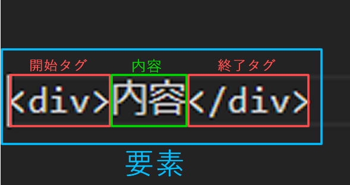
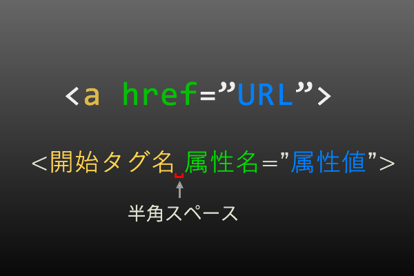

# HTML要素
HTMLコードを書く上での基礎知識です。
知らなくてもかけるけど。知っておくとなぜ書き間違えたかがりかいできます。
したがって間違いの少ないコードを変えるようになります。

## HTML要素の部位解説
- 要素 エレメント
- 開始タグ
- 終了タグ
- 内容

参考資料
>[HTML を始めよう
](https://developer.mozilla.org/ja/docs/Learn/HTML/Introduction_to_HTML/Getting_started)


### 要素　エレメント

#### div要素で解説
```

<div>内容</div>

```




開始タグから終了タグまでを要素と呼びます。
要素(Element): 開始タグ + 内容 + 終了タグが要素になります。

### 開始タグ
開始タグ(Opening tag): 要素名 (この場合は "div")、囲っている開き山括弧と閉じ山括弧で構成されています。これは要素が始まってその効果が開始する位置を宣言しますーこの場合、段落が始まる位置です。

### 終了タグ
終了タグ(Closing tag): 要素名の前に一つのスラッシュが含まれることを除けば、開始タグと同じです。これは要素の終了を宣言しますーこの場合、Div要素が終わる位置です。
終了タグを忘れるのは初心者にありがちなミスで、おかしな結果になってしまいます。

### 内容
内容(Content): これは要素の内容で、
開始タグと終了タグに挟まれた部分が内容となります。
内容にはテキストだけでなく子供となる要素も入ります。


##### ポイント
- 開始タグ　終了タグ　内容の順番で書くとミスが減ります。


### ネスト構造 (入れ子構造)
>[ネスト構造 ](https://developer.mozilla.org/ja/docs/Learn/HTML/Introduction_to_HTML/Getting_started#Nesting_elements)

要素の中に要素を入れることができますーこれは“ネスト” (入れ子) と呼ばれています。たとえば “私たち人間という存在は、身と心によって成り立っている。” と記述したい場合、“身と心” という語を <strong> 要素で囲むことができ、それはその語がより強く強調表示されることを意味します：

```
<p>
私たち人間という存在は、<strong>身と心</strong>によって成り立っている。
</p>
```

#### 正しい要素の終了をしめさないといけない。

P要素の中にストロング要素が入っている状態にしないといけません。


#### NG例
 親子関係が崩れたマークアップはNGです。

```
<p>
私たち人間という存在は、<strong>身と心によって成り立っている。
</p></strong>
```

```
<strong>
<p>
私たち人間という存在は、身と心</strong>によって成り立っている。
</p>
```


ちなみにストロング要素はp要素の親要素には性質上なりえません。

意識してコーディングしていればこのエラーはあまり起こさないようになります。
コピー＆ペーストやカットをするときも要素の切れ目や親子関係をよく見てからしましょう。

複雑なコーディングをするときは同じ名前の要素がたくさんでてきて、終了タグと開始タグの組み合わせがわからなくなることが多々あります。
コメントアウトをうまくつかってネストエラーを防ぎます。
HTMLのデバックの半分はこのネストエラーです。

###### ポイント

- HTML要素はマトリョーシカのような入れ子構造になっている よく似た構造のもの 箪笥構造（箪笥-引出-棚や小箱-衣服） - 樹木構造（木-幹-枝-葉っぱ）
- ネスト構造が崩れると表示が崩れます。
- 必ず親要素がある。
- 元祖要素はHTML要素


---
## 空要素

空要素は終了タグがありません。
挿入したり　改行するポイントを指定したりするタグなどがありますが。内容を持たないタグのこことを空要素と呼びます。

### 下記の要素は初期に覚える空要素です。

例）
```

```
|要素名|役割|
|:--|--|
|[&lt;meta&gt;](https://developer.mozilla.org/ja/docs/Web/HTML/Element/meta)|htmlファイルの書設定|
|[&lt;link&gt;](https://developer.mozilla.org/ja/docs/Web/HTML/Element/link)|htmlファイルとリンクする関係を設定|
|[&lt;img&gt;](https://developer.mozilla.org/ja/docs/Web/HTML/Element/img)|画像を挿入する。|
|[&lt;hr&gt;](https://developer.mozilla.org/ja/docs/Web/HTML/Element/hr)|推移線を挿入する|
|[&lt;br&gt;](https://developer.mozilla.org/ja/docs/Web/HTML/Element/br)|テキストを強制改行する|
|[&lt;input type="text"&gt;](https://developer.mozilla.org/ja/docs/Web/HTML/Element/input)|入力アイテム|

##### ポイント
- 空要素は終了タグが無い（書いてはいけない）
- 上記の空要素をまずつかっておぼえてください。


## 属性と属性値
[属性](https://developer.mozilla.org/ja/docs/Learn/HTML/Introduction_to_HTML/Getting_started#Attributes)

属性は要素追加情報をセットします。
属性の名前と属性値で構成されます。  
必ず開始タグの中に書きます。  
２つ以上の属性をセットする場合は半角のスペースで区切ります。

####  開始要素　属性付きの表記

- &lt;
- 開始タグ名
- 半角スペース
- 属性名
- イコール
- ダブルクオート（はじまり）
- 属性値　
- ダブルクオート（おわり）
- （次の属性があれば） 半角スペース
- &gt;

の順番で並びます。  
終了の&gt;や引用符内以外に余計なスペースや改行などの制御コードを入れないように書きます。





正しい書き方の例
```


<a href="https://developer.mozilla.org/ja/docs/Learn/HTML/Introduction_to_HTML/Getting_started#Attributes">属性の説明</a>
```

###### ポイント
- 開始タグの中に属性名と属性値
- 属性名と属性値の間はイコールが入る
- 属性値は引用符で囲まれる。
- 開始タグと属性値の区切りは半角スペース
- 属性値と次の属性名の間の区切りも半角スペース

### 属性と属性値種類

属性の種類についてかるく書きますが実際にタグを覚えながら属性も覚えていくのがいいとおもいます。
辞書を引きつつセットでおぼえていってください。


#### 必須属性
img要素のsrc属性（エスアールシー属性）やalt属性（オルト属性）a要素のhref属性（エイチレフ属性）
など記述がないとタグの機能を発揮しない属性があります。
属性値の値の書き方も含め要素を覚えると一緒にセットでおぼえましょう。

#### 汎用属性(グローバル属性)

class属性やid属性title属性などほとんど要素にセットできる属性もあります。
役割を理解して使用することでブラウザの機能をうまく利用することができます。 

#### 真偽値
真偽値とは「true」と[flse]　
「ON」と「OFF」や　「正」と「偽」とほぼ同じ意味になります。
HTML5になり真偽値系の属性は属性名を記述するだけでその値が「true」とブラウザが読み取るようにプログラミングされています。

`<input type="button" value="cant push" disabled>`　
`<input type="button" value="can push">`　

---
## 要素辞書の見方
HTMLタグを勉強するときwebで辞書をひきます。

'MDN　HTML　要素名'
この３つのキーワードでGoogle検索だとMDNさんの辞書にたどりつけます。


### MDN(Mozilla Developer Network )をなぜすすめるのか？
ブラウザfireFoxのメーカーであり
GoogleChrme　Edgeのタグリファレンスをまかされている会社だからです。
日本語化も進みやや難解ではありますがW3Cを翻訳してくれています。

### 終了タグ省略可
要素によっては終了タグを省略可能な場合があります。
ブラウザの仕様上省略されたばあい終了部分を予測して要素を確定しますが。
明示的に制作者が終了タグを明記するべきです。

### 内容の制限
要素によっては内容になるコンテンツモデルがきまっています。コードエラーを起こさないためにも要素ごとに何がいれれるのかを理解してマークアップします。
*これができないと仕事になりません。*

コンテンツモデルとは要素の分類（種類）です。
詳しくは後ほど。

### 勧告段階
要素や属性がW3Cでどの審議ステータスにあるかを知ることができます。
勧告済みが最終です。

### 実装ブラウザ
要素によっては審議中やメーカーが重視せず未実装の要素などもあります。
実装されてからの勉強になります。

### 使い方の見本コード
コードの見本がありますので使い方の具体的な確認ができます。

### 必須属性
アンカー要素のような要素の役割によっては属性が必ず必要になります。
なにが必要かだけは押さえておきましょう。


---
# HTMLソースコード

## 「&lt;」「&gt;」の中と外

#### 「&lt;」「&gt;」の外
テキストなど生の文字列がはいります。
子要素としてまた開始宣言が始まります。

#### 「&lt;」　「&gt;」の中
HTMLやXHTML XMLなどの表示データ形式は
データとしての指示部分の冒頭を半角小なり`&lt;`で始め
終わりを半角の大なり`&gt;`でおわります　

表示されるのではなく要素が始まる宣言と終わりの宣言であるため中身の文字を機械的に処理します。表示のためのテキストとは判断しないわけです。
```

<a href="#">[表示用の文字列]</a>

ポイント
- HTMLを書いてい何をかいているかわかるようになれば「&lt;」　「&gt;」の中と外の区別がつきます。

```
---

### 半角とタブ

#### 参考
>[HTML 内の空白](https://developer.mozilla.org/ja/docs/Learn/HTML/Introduction_to_HTML/Getting_started#Whitespace_in_HTML)

キャラクターデータ内半角とタブは２つ以上入力しても１つとして表示されます。
また改行コードも若干の空白を表示します。

半角スペースタグのなかではセパレータとして使う部分以外は無視される。

全角の空白は完全な空白の文字としてあつかわれいます。

タブはコードインデント以外でTabをつかわないです。

ポイント
- 半角スペース　改行コード タブは内容だと半角スぺース一つ分の空白になる。
- 全角スペースはただの文字
- タグのなかでは決められたところ以外半角スペースをいれない。改行もでるだけしない。
- コードインデント以外でTabをすかわない。

##### コードインデント（行送り）

コードインデントの数や種類はプロジェクトによりことなります。
半角スペース4つ分もしくはタブ一つがよくみるインデントのルールです。
決まったインデントのルールを守りましょう。
コードを整理できるようテキストエディタの機能をつかいましょう。
UPするサーバや使うCMSによりことなります。


### ダブルクオートとシングルクオート

いわゆる引用符と呼ばれる部分の範囲を明示してくれるダブルクオートとシングルクオート

HTMLでは属性値を属性にセットするときに使います。

```
<a href="URL">link-text</a>
```

```

"" OR '' ? dotch?
```


属性値に入力されるときに挟み込むダブルクオートとシングルクオートですが　基本的にペアになっていればどちらでもOKです。

NG例
```
<a href="#'> link-text </a>
```

しかし後で勉強するPHPyaJavascriptの記述とごっちゃになるのでHTMLファイルレベルでは*ダブルクオート*で統一しています。

###### ポイント

- HTML CSSでは引用符はダブルクオートにする。
- 必ず始まりと終わりのダブルクオートを書かないといけません。

---
## HTMLのコメントアウト

コメントアウトとはその記号で挟まれた部分はブラウザとして無視して次の処理をしてくれます。
制作者にとっての目印などにつかわれます。

HTMLで使われるコメントアウトは１種類です。

```
<!-- コメント部分 -->
```

#### コメントを書くときの注意

1. マイナスを連続して２つ記述することが`--`
コメントの開始と終了を（宣言）意味しています。
ですので `--` をコメントの中に連続して書き込むとバリデートエラーになります。
（すごく困らないけどだめです。）

NG例）
```
<!-- -----コメント部分----- -->
```

2. ネストできません。　

NG例）
```
<!--

 <!--コメント部分-->

-->
```

コメント宣言`-->`がブラウザに表記されるでしょう。

コメントを書くときはこの２点を注意しましょう。


##### ポイント
"<!-- -->" をしらべなくても書けるようになる。


---
### 実態参照文字 
>[実体参照: HTML に特殊文字を含める](https://developer.mozilla.org/ja/docs/Learn/HTML/Introduction_to_HTML/Getting_started#Entity_references_Including_special_characters_in_HTML)

半角で&gt;や&lt;をブラウザで表示したい場合は特殊文字をつかいます。

&amp;アンプで始まり；セミコロンで終わる記号です。
使用するシステムで同じ文字でも書き方がかわるのですが概ねローカルや普通のレンタルサーバーで公開する場合は下記の実体参照文字を入力することで表示できます。


|読み方|文字|実体参照文字|
|--|:--|--|
|小なり /レスザン|&lt;|`&lt;`|
|大なり/グレーターザン|&gt;|`&gt;`|
|アンバサ/アンプ|&amp;|`&amp;`|
|ダブルクオート|&quot;|`&quot;`|
|シングルクオート|&apos;|`&apos;`|
|半角スペース/No Brake SPace|&nbsp;|`&nbsp;`|
|著作マーク|&copy;|`&copy;`|


HTMLでは特殊文字として下記の文字を定義しています。
- &lt;
- &gt;
- &amp;

を直接記述して表示することができなくなっています。
上記も文字は実体参照文字をつかてコード化して入力します。

##### ポイント
 &lt;,
 &gt;,
 &amp;をブラウザで表示する場合は実態参照文字を使う。


<cite>
>[List of XML and HTML character entity references](https://en.wikipedia.org/wiki/List_of_XML_and_HTML_character_entity_references)
</cite>
---

