# htmlファイルを作ってみましょう。

ここでは比較的簡単にHTMLファイルを作ってブラウザで見てみる。
自分の書いたソースコードがブラウザで確認できる。
只のテキストファイルとHTMLファイルの違いを知っていただく簡単な目的です。

### この講義の概要　
簡単なwebページをつくります。
フォルダの作成から始まりHTファイルとCSSファイルをコピペを多様し簡単に編集。
最後まで進めると
##### これが before
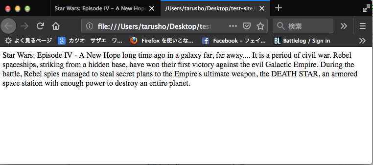
##### こうなります。after
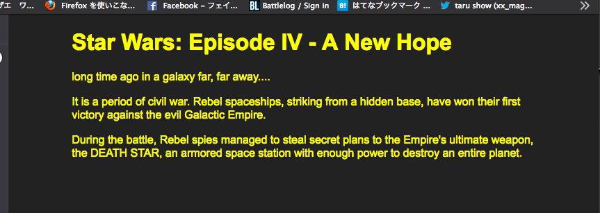
背景色の変更と文字の色野変更をしています。


## 目次
- サイトの準備
- htmlファイルの中身を編集する。
- CSSファイルを作りHTMLファイルにリンクし完成を確認する。
- 終わりに、


## サイトの準備

webサイトを作る時は其の規模に関わらずフォルダ（ディレクトリー）を用意してこの中でファイルを作成します。

#### ファイルとフォルダの命名でのルール
ファイル名フォルダ名はすべて半角英語で命名します。
「全角半角キー」「ことえり」など日本語変換ソフトのアイコンを確認し設定しなおしてください。

#### プロジェクトフォルダを作る。
プロジェクトフォルダ単位で作品を管理します。
最初にあるサイトがすべて入っているフォルダをRootフォルダ（ディレクトリー）と総称します。


### サイトのファイル相関図

これから制作する相関図はこんな感じになります。


```

test-site （Root) フォルダ  
    ↓
     ->   index.html
     ->   style.css
```

フォルダの中にそれぞれ１枚のhtmlファイルとCSSファイルを作成します。


#### ルートフォルダを作る。  
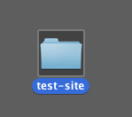

gif動画
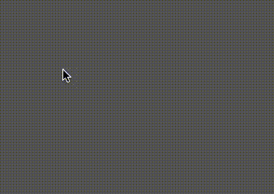

rootフォルダの名前は「test-site」に今回はします。

[作り方]
デスクトップにtest-siteという名前のフォルダをつくってください。
デスクトップを直接クリックし新規フォルダーから名前をつけます。  

名前がつけられない場合、名前の変更はフォルダを選んでenterキーを押すと編集モードどになります。  
ウィンドウズでは「F-2」キーがショートカットキーになっています。

この作業がサクサクできるかたは制作などのファイル操作を良くしている方です、解らない操作があれば伺ってください。

#### フォルダの中に新しいファイルを作ります。

テキストエディタを使ってファイルをつくっていきます。

「テキストエディタ」とはプレーンテキストを編集するソフトの総称です。
OSXでは 「CotEdita」 もしくは「mi」など既にソフトとして入っている「テキストエディット」でもかまいません。

windows10では TeraPad をダウンロードして使います。
なければ「メモ帳」でもこの程度のファイル編集ではかまいませんが本格的な制作となるとコードアシストや文字の色を種類別にわけてくれる高性能なエディタを将来は使うようにしましょう。

みなさんの作業が均一になるよう講師の勧めるエディタをつかってください。

##### htmlファイルを白紙で作る

` index.html`
メニューバーのファイルメニューからファイルを新規で作成。
ファイルの名前をindex.html と半角英語で入力します。
注)保存先を ***「test-siteフォルダー」*** に指定して保存します。

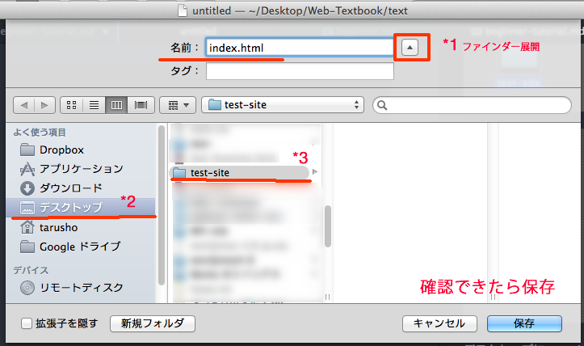

1. 保存ダイアログボックスの上矢印アイコンをクリックし展開する。
2. 良く使う項目から　デスクトップを選択
3. 指定したいフォルダーを選択
4. 上記作業を確認できたら「保存」ボタンを押す。

##### 作業に失敗した。
デスクトップに直接保存したり作業に失敗したかたは一度編集中のエディタソフトごとドキュメントを閉じてアプリケーションを終了させてください。
その後ファイルをファインダー（ファイルエクプスローラー）から移動してください。


いまは中身は白紙まま結構です。

ヒント) ファイル名は コピーアンドペーストでもOK
です。

|機能|ショートカットキー|
|:---|:---|
|コピー | ctrl + c |
|切り取り | ctrl + ｘ |    
|貼付け/ペースト| ctrl + v |   

#### CSSファイルを白紙で作る。

```
 style.css
```
ファイルを同じフォルダ階層につくります。
エディターから新規保存して
拡張子をCSSで保存してください。

中身の書き方は後ほど教えますので白紙のままで保存してください。

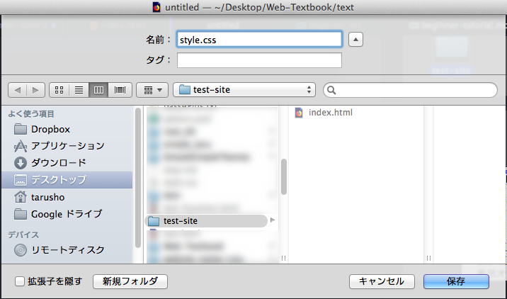

#### 完成時のファインダー

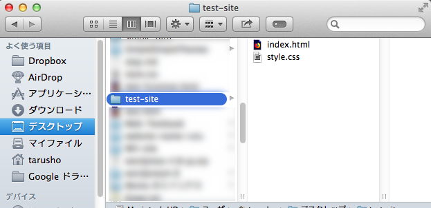

サイトのファイル相関図を手本に極小規模な１ページのサイト構成ができるファイル群ができました。

続きは各ファイル中身の編集をしていきましょう。


ーーーー
続きを読む

ーーーー

# htmlファイルの中身を編集する。

####プレーンテキストを用意します。
正しくマークアップされたHTMLファイルの表示と正しくない書式のHTMLファイルでみた ブラウザの表示を比較するためプレーンテキストを用意します。

ここからは実際にHTMLをテキストエディタで記述する作業になります。
解説も専門的になってきます。


アシスト）サンプルコードもありますのでコピーアンドペーストをつかってください。

### htmlに表示する原稿

まず下記に用意した内容を
コピーして 先ほどつくったindex.htmlにペーストします。

<small>原稿の内容は重要ではございません。</small>
<blockquote>
Star Wars: Episode IV - A New Hope

long time ago in a galaxy far, far away....


It is a period of civil war. Rebel spaceships, striking from a hidden base, have won their first victory against the evil Galactic Empire.

During the battle, Rebel spies managed to steal secret plans to the Empire's ultimate weapon, the DEATH STAR, an armored space station with enough power to destroy an entire planet.

</blockquote>

ここまでをコピー

出典: [Star Wars: Episode IV - A New Hope | StarWars.com](https://www.starwars.com/films/star-wars-episode-iv-a-new-hope)

[スターウォーズ オープニングクロールのまとめ（全文+日本語訳） - NAVER まとめ](https://matome.naver.jp/odai/2139843997406549301)

----
著作権的にまずい場合はあらかじめプレーンテキストを用意してください。
----


## 手順

### 1. index.htmlを任意のテキストエディターで開きます。

普通にダブルクリックしてindex.htmlファイルを実行すると、
白紙のブラウザが開くだけなので、
編集する時は編集用のソフトを指定します。
編集するときは別の方法で編集用アプリケーションで開きます。


#### 「アプリケーション指定して開く」開き方。


ファイルアイコンを右クリックしてコンテキストメニューを開きます。
テキストエディターソフトを選びましょう。
どのアプリケーションかは講師にお尋ねください。

空のindex.htmlが開けたら。
原稿をコピーして貼付けます。

貼付ける場所は左上におねがいします。


#### 貼付けたらそのまま「上書き保存」をしましょう。
ファイル＞上書き保存（保存/save / セーブ）


ヒント）

|機能|ショートカットキー|
|:---|:---|
|保存（セーブ）| ctrl + ｓ |  
|別名で保存（セーブ）| ctrl + shift + ｓ |   
|ファイルを開く|ctrl  + o |
|編集のやり直し| ctrl + z |
|編集のやり直しを巻き戻し| ctrl + y もしくは ctrl + shift + z|   


(アプリケーションを開きテキストをはりつけて保存するまでの動画 動画)


### 2. ブラウザでの表示確認

保存ができたら今度はindex.html ファイルをブラウザで実行します。


プレーンテキストで貼付けたため、
文字は表示されますが文字の形や大きさ、文字周りの余白など、情報が確認できる最低限の表示しかされません。

これは　正式なHTML形式のテキスト構文を使っていないため、ブラウザがあらかじめ用意しているテキスト表記に従い表示しているだけにすぎません。
ブラウザは文字が有ることだけを認識しています。


それでは index.htmlに貼付けた文章を本文として、このファイルをHTML形式に加工していきます。

## 3. html形式にマーアップしていきます。

コーディングともいいますが、文章をHTML形式に編集する作業をマークアップと呼びます。
実際にコーディングをする作業は 「 ４ 実際のコーディング作業」でします。


---

### HTMLの専門解説
注（専門的な解説になります。飛ばし読みしてください。
ただし　意味を理解してHTMLを記述するようになるには必要な項目です。）


### タグとHTML要素の解説
htmlファイル形式の構造

１、文書型宣言文  
２、HTML要素

大きく２つの構造になります。

#### 1.文書型宣言
文書型宣言文はこのHtmlファイルはどのバージョンやタイプのhtmlファイルで書かれているのかをブラウザに通知して描画を正しくするために必要です。

#### html5以上の場合の宣言文

`<!DOCTYPE html > `

一番上の行にこの文字列があればブラウザは*html5*での描画モードになります。

DTD宣言は必ず最初の行に余白なく１文だけ入ります。

htmlファイルの形式は開発とともに進化し バージョンはhtml5.2になっています。主立ったブラウザはユーザーの安全が確保されている限り、
バージョンが古くても正確な形式で書かれて旧バージョンのHTMLファイルも現行ブラウザで表示してくれるように設計されています。


#### 2 HTML要素

html要素とはHTMLファイルを構成するルートとなる要素です。
この要素中身があって樹状構造になっています。

##### 樹状構造
 パソコンのファイル管理での配置整理関係
 家では「タンス>引き出し>敷居」と区分けする一般的な整理スタイルです。
HTML構文は文章を要素で区分けする作業でもあります。

html要素の中に表示したい内容やhtmlファイルの細かな設定を記述していきます。

```
<html> 内容(contents) </html>
```

##### 要素とは
element エレメントと呼ばれる要素はHTMLの構成単位です。
html要素を起点（Root / 元祖）として中に必要名要素を記述します。

要素の構造
```
<開始タグ> 内容 </終了タグ>
```
開始タグ 内容 終了タグ の順番で構成されす。

####  タグtag
タグ(tag)とは要素の始まりと終わり種類をマークするものです。

記述の注意
半角英数小文字でないといけません。全角ではHTMLとおして認識されません。
半角英数大文字でも問題なく動きますが、メンテナンス性や他の言語の互換性の都合上「**半角英数小文字**」で書きましょう。

タグの書き始めは半角の'<'ではじまり半角の'>'でおわります。
'<>' で括弧のように挟まれています。

中にはタグ名がはいります。　タグ名は規定されておりそれぞれ役割があります。
```
<タグ名> contents area </タグ名>
```

##### 開始タグ
其のタグの種類と始まりがあります。属性と呼ばれるタグの設定の記述もここにはいります。

##### contents area
contents areaはその要素の内容になります。
子要素としてさらに要素をいれて入れ子構造に要素を組むことになります。

##### 終了タグ
其の要素の終わりを意味します。
タグの名のまえに半角スラッシュ'/'をいれてます。

html要素記述
```
<html> 内容(contents) </html>
```

#####  html用のコメント
コメントとはHTMLの表示に影響しない
目印やメモなどをつけるための制作者のための記号です。
```
<!-- コメント部分 -->
```

### html要素の中身を書きます。

要素には最初に入る中身が決まっている要素があります。
html要素の場合は必ず最初にhead要素　次にbody要素の２つがはいります。
```
<html>
 <head></head>
 <body></body>
</html>

```
##### 親要素と子要素
要素の構造を説明する言葉です。
要素のなかに要素がある状態を「入れ子構造」とか「ネスト構造」といいます。
また親子構造とも呼びます。
並列に並んだ要素の関係を兄弟要素と家族にちなんだ呼び方をして要素の関係性を理解します。

html要素子要素はhead要素とbody要素で　head要素とbody要素は兄弟要素です。

##### 開始タグと終了タグの位置に注意
必ず終了タグは子要素を内包するような位置に記述しないとエラーになります。
（といっても無効なコードになるだけで表示はします。）

NG 例１
```
<html>
 <head></head>
</html>
 <body>
 </body>

```
解説　html要素がhead要素とbody要素を内包していない。

NG 例２
```
<html>
 <head>
 <body>
 </head>
 </body>
</html>
```
解説　：html要素がhead要素の子要素としてbody要素を内包している。


マークアップ作業は範囲を指定する作業です。範囲とは始まりと終わりを指定されたものでその指示が曖昧で
しかも関係に矛盾が発生するようなコーディングは
ほぼ間違っているとかんがえてください。


#### head要素

head要素はHtmlファイルを表示する諸設定を記述します。
実際に閲覧者が見る情報は少ないです。

#### body要素

body要素は表示する本文を記述します。
実際に閲覧者に見られる内容を記述します。

html要素なかのhead要素とbody要素の記述順番は決まっています。
形として覚えておきます。

##### head要素の中身
```
<meta charset="UTF-8">
<title> タイトルを記述 </title>

```

hrad要素の細かな中身は割愛し　必要最低限の記述をします。

` <meta charset="UTF-8">`は文字化けを防ぐ記述です。
ここでは詳しくは割愛します。

`<title> タイトルを記述 </title>`はこのファイルのタイトルで
googleなどで検索した時の結果文章やブラウザのタブに表記されます。

-----

## ４ 実際のコーディング作業
### Step1  DTD 宣言を一行目に記入

```
<!DOCTYPE html>
Star Wars: Episode IV - A New Hope

    long time ago in a galaxy far, far away....
```

### Step2   html要素を挿入

つぎ行にhtml開始タグ<html>
最後の行に</html>で終了タグをいれます。


```
<!DOCTYPE html>
<html>
  Star Wars: Episode IV - A New Hope

    long time ago in a galaxy far, far away....


    It is a period of civil war. Rebel spaceships, striking from a hidden base, have won their first victory against the evil Galactic Empire.

    During the battle, Rebel spies managed to steal secret plans to the Empire's ultimate weapon, the DEATH STAR, an armored space station with enough power to destroy an entire planet.
</html>
```

### Step３ head要素を挿入

html要素のhtmlの開始タグの次にhead要素を記述

```
<!DOCTYPE html>
<html>
<head>
</head>
  Star Wars: Episode IV - A New Hope

    long time ago in a galaxy far, far away....


    It is a period of civil war. Rebel spaceships, striking from a hidden base, have won their first victory against the evil Galactic Empire.

    During the battle, Rebel spies managed to steal secret plans to the Empire's ultimate weapon, the DEATH STAR, an armored space station with enough power to destroy an entire planet.
</html>
```

### Step４ body要素を挿入

head要素の兄弟要素になるように
body要素の開始タグをhead要素の終了タグの次に記述する。

body要素の終了タグは　</html>の前に書きます。

```
<!DOCTYPE html>
<html>
<head>
</head>
<body>
  Star Wars: Episode IV - A New Hope

    long time ago in a galaxy far, far away....


    It is a period of civil war. Rebel spaceships, striking from a hidden base, have won their first victory against the evil Galactic Empire.

    During the battle, Rebel spies managed to steal secret plans to the Empire's ultimate weapon, the DEATH STAR, an armored space station with enough power to destroy an entire planet.


</body>
</html>
```
### Step５ head要素の中身を記述

文字コードを指定する<meta>要素と属性
タイトル要素をいれ中身を書き換えます。
```
<!DOCTYPE html>
<html>
<head>
<meta charset="UTF-8">
<title> ここにこのページのタイトルが入ります。</title>
</head>
<body>
  Star Wars: Episode IV - A New Hope

    long time ago in a galaxy far, far away....


    It is a period of civil war. Rebel spaceships, striking from a hidden base, have won their first victory against the evil Galactic Empire.

    During the battle, Rebel spies managed to steal secret plans to the Empire's ultimate weapon, the DEATH STAR, an armored space station with enough power to destroy an entire planet.


</body>
</html>
```

### Step５までの進捗コード html形式の書式としてざっくりとマークアップしたところ。

 ```
<!DOCTYPE html>
<html>
  <head>
  <meta charset="UTF-8">
  <title> Star Wars: Episode IV - A New Hope </title>
  </head>
  <body>
    Star Wars: Episode IV - A New Hope

    long time ago in a galaxy far, far away....


    It is a period of civil war. Rebel spaceships, striking from a hidden base, have won their first victory against the evil Galactic Empire.

    During the battle, Rebel spies managed to steal secret plans to the Empire's ultimate weapon, the DEATH STAR, an armored space station with enough power to destroy an entire planet.
  </body>
</html>

 ```

 上手く書けないない時はコピペ対応をお願いします。

### ひな形

普段はこのような「ひな形」がエディターに用意されていることもあります。

```
 <!DOCTYPE html>
 <html>
   <head>
   <meta charset="UTF-8">
   <title> ここをページのタイトルに書き換える </title>
   </head>
   <body>
     <!--  ここに表示したい本文をいれる -->
   </body>
 </html>
```

#### 表示を確認します。

ファイルをセーブしてブラウザを更新しましょう。
ブラウザの更新は　ショートカットなら「Ctrl + r 」
 もしくはファンクションキー 「F-5」

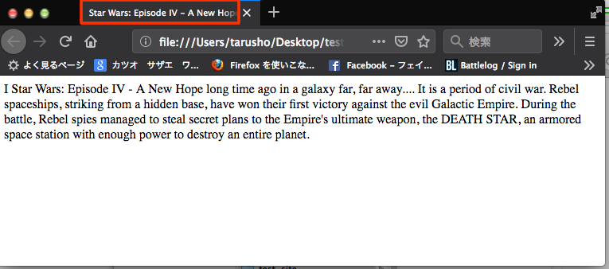

残念ながらまだ　body要素に詳細なマークアップをしていないためブラウザは挿入した文章が本文であることぐらいしか認識していません。
あくまでHTLのテンプレートが準備できた段階です。ここからタグを適宜追加していくことで見た目喪変化します。

タイトル要素を記述したためタブの表示は変わっています。

----
## body要素に文章構造にあったタグでマークアップする。

### 使う要素
- div要素
- h1 要素
- ｐ要素

### `<div>`要素を挿入する。

body要素の子要素に<div>要素を挿入する。
のちほどCSSで文章を真ん中に寄せるために入れる役割をもたすので終了タグはbody要素の終了タグの前に記述。
div要素を記述しても特別な見た目の変化はありません。
div要素の役割は文章のグループ化やスタイルの適応で活躍する要素です。
```
<!DOCTYPE html>
<html>
 <head>
 <meta charset="UTF-8">
 <title> Star Wars: Episode IV - A New Hope </title>
 </head>
 <body>
 <div>
   Star Wars: Episode IV - A New Hope

   long time ago in a galaxy far, far away....


   It is a period of civil war. Rebel spaceships, striking from a hidden base, have won their first victory against the evil Galactic Empire.

   During the battle, Rebel spies managed to steal secret plans to the Empire's ultimate weapon, the DEATH STAR, an armored space station with enough power to destroy an entire planet.
   </div>
 </body>
</html>

```
### `<h1>`要素をマークアップ

h1要素は本文の大見出しの意味をもっています。
数字で階級を表しており１が重く６が一番軽い見出しです。
重い　h1 > h2> h3 > h4> h5 > h6　軽い

この見出しの階層をうまくつかって文章の詳細な話題をラベリングしていきます。

デフォルトのスタイルをもっており。
前後で改行し文字は２倍の大きさ　上下に余白　そして太文字に表示時されます。

#### `<h1>`を入れる例
```
<!DOCTYPE html>
<html>
 <head>
 <meta charset="UTF-8">
 <title> Star Wars: Episode IV - A New Hope </title>
 </head>
 <body>
 <div>
   <h1>Star Wars: Episode IV - A New Hope</h1>

   long time ago in a galaxy far, far away....


   It is a period of civil war. Rebel spaceships, striking from a hidden base, have won their first victory against the evil Galactic Empire.

   During the battle, Rebel spies managed to steal secret plans to the Empire's ultimate weapon, the DEATH STAR, an armored space station with enough power to destroy an entire planet.
   </div>
 </body>
</html>

```

入力後セーブして確認しましょう。

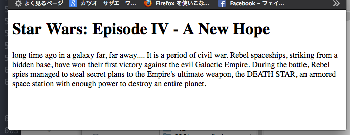

### `<p>`要素をマークアップ

p要素は段落を意味する要素です。見出しに付随する細かな記事や文章をマークアップします。
英文だとピリオドごとに　日本語だと句読点や文節などで区切ると上手く見えますが、正しい規定はありませんのでコード違反や不自然にならなければ自由にマークアップできます。


デフォルトで表示される文字は見出しとは反対に文字の大きさや太さはかわりませんが、
前後の改行と上下の余白がでます。


#### `<p>`を入れる例
```
<!DOCTYPE html>
<html>
 <head>
 <meta charset="UTF-8">
 <title> Star Wars: Episode IV - A New Hope </title>
 </head>
 <body>
 <div>
   <h1>Star Wars: Episode IV - A New Hope</h1>

   <p>long time ago in a galaxy far, far away....</p>

   <p>
   It is a period of civil war. Rebel spaceships, striking from a hidden base, have won their first victory against the evil Galactic Empire.
   </p>
   <p>
   During the battle, Rebel spies managed to steal secret plans to the Empire's ultimate weapon, the DEATH STAR, an armored space station with enough power to destroy an entire planet.
   </p>
</div>
</body>
</html>

```

簡単なマークアップができました。

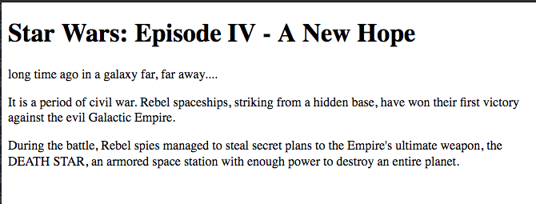
P要素でマークアップしたところで改行されていたり余白がでていることを確認してください。

書体の違いなどはCSSでセッティングします。

##### HTMLタグだけのデフォルトの見た目
Html要素だけでもブラウザは見た目をもっており見れない読めない　推測できないなど閲覧者が内容にアクセスできる最低限の見た目を保持しています。

次の章では　少し見た目を文章のテイストによせていきたいとおもいます。

----

# CSSファイルを作りHTMLファイルにリンクする。

----

スタイルシートの役割の確認のため。
今作ったHTMLファイルにCSSを適応して見た目を変更したいとおもいます。

## 目次
- 空のスタイルシートにCSSの書式をいれる。
- スタイルシートファイルをHTMLファイルにリンクする。
---
### 空のスタイルシートにCSSの書式をいれる。
####  スタイルシートを編集する
style.cssをテキストエディタでひらきましょう。
ここからはこのstyle.cssファイルを編集します。

スタイルシートの書式
スタイルシートには宣言文などはないですが、設定用の記述が必要です。

`@charset "utf-8";`
日本語の文字コード「utf-8」に指定します。
テキストエディタのエンコードモードも「utf-8」でにしてください。
改行コードはこの作業ではこだわらないですが LF があればそれにしておきます。

##### Step1 `@charset "utf-8";`を１行目に余白なくペーストしてください。
ここから下に実際にwebページを装飾するスタイルシートを書いていきます。

#### Step2 スタイルシートを用意しましたのでstyle.cssにはりつけてください。

```
body{
  background-color:#222;
  font-family:arial,sans-serif;
}

div{
width:80%;
margin:0 auto;
}

h1{
  color:#ff0;
}

p{
  color:#ff0;
}


```

貼付けた 「style.css」 ファイルの例
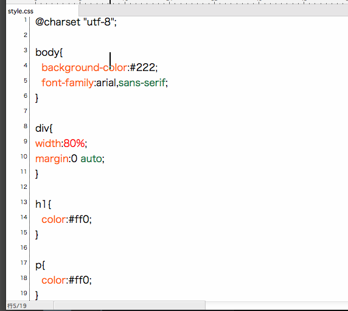

完了したらセーブしください。

注)スタイルシートの個々の解説は本校授業でおたのしみください。

### スタイルシートファイルをHTMLファイルにリンクする。

webページの本文であるindex.htmlにstyle.cssをよみこませる記述をすることでwebページに制作者のスタイルを反映することができます。
この関連付けの作業をスタイルをリンクすると呼びます。

#### リンクの記述方法
ファイル : index.html
位置 : head要素内 title要素下に記述します。
リンクの記述 : `<link rel="stylesheet" href="style.css">`

##### step3 記述場所
```
<meta charset="UTF-8">
<title> Star Wars: Episode IV - A New Hope </title>
<link rel="stylesheet" href="style.css">
```

#### 完成文

```
<!DOCTYPE html>
<html>
 <head>
 <meta charset="UTF-8">
 <title> Star Wars: Episode IV - A New Hope </title>
 <link rel="stylesheet" href="style.css">
 </head>
 <body>
 <div>
   <h1>Star Wars: Episode IV - A New Hope</h1>

   <p>long time ago in a galaxy far, far away....</p>

   <p>
   It is a period of civil war. Rebel spaceships, striking from a hidden base, have won their first victory against the evil Galactic Empire.
   </p>
   <p>
   During the battle, Rebel spies managed to steal secret plans to the Empire's ultimate weapon, the DEATH STAR, an armored space station with enough power to destroy an entire planet.
   </p>
</div>
</body>
</html>
```
### style.cssがリンクされた状態


確認できれば　「**完成**」　です。

マークアップした要素とCSSの記述が完成したのでスタイル（見た目）を指定できました。
要素を正しく入れることで文字を装飾したり。アプリケーションにあった配置にしたり。
プログラクを埋めることができたりします。
フロントエンジニア（Webデザイナー）はこの技術を専門的にサービスする仕事です。

時間があればもっと凝った感じにしていきます。


----
### CSS書式 解説

長いので以下略


```
/* コメント */
```

#### ルールセット
```
セレクタ {
  プロパティ : バリュー ;
}

```
セレクタ：HTMLの要素範囲を指定
プロパティ：要素の設定が出来る項目名
バリュー：変更する値を入力。

---


---

### 今回のデータの処理

今回使ったはゴミ箱にお捨てください。

---

----
# 終わりに、
## 本校の授業では
##### 基礎講座
購入されるテキスト（本）や学習サイトをつかって授業がすすみます。
担当される講師、授業時間数が口座により違い一概には言えませんが、
約3日間を目安に授業で基礎のHTML CSSを講義します。
（この講義は１日から２日分の内容を含んでいます。)
その後の授業は３日間の補完と現行のwebトレンドについていける内容に調整されています。

##### グループ制作
webグラフィックの授業もあわせ後半の期間は依頼者からのWeb制作をグループワークとしてしていただき。完成したwebサイトを就職活動用の作品集（ポートフォリオ）として利用できます。
