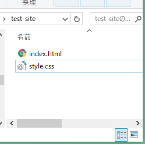
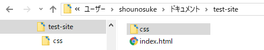

#ファイルパス

ファイルパスの書き方と種類を解説します。
画像や動画をページに挿入したり。ページの遷移をするアンカータグに必要な知識です。

単にパスとも現場ではいわれていますが。パスとは日本語で訳すと「通す」という意味で
リクエストを通すとか関連づけるとか紐付けるとなどといいかえられます。
ファイルやデータ間の関連性を明示するための技術です。


### リソース
リソースとは資源という意味です。Webサイト制作ではページを構成するのに必要な画像データやファイル　プログラムなどHTMLファイルがリクエストするデータファイルのことを総称して呼びます。

## ファイルパスの表記方法

1.絶対パス。
2.相対パス。
3.ルートからの相対パス。

表記の基準はURI形式です。3種類のパスの記述があります。

URI（Uniform Resource Identifier）形式とは　ファイルとフォルダーの保管場所を表す方式でコンピューター技術で一般的に使われる。ファイル位置の表記方法です。パソコンの中の住所表記方法とでもおもっておいてください。

## 1.絶対パス。

URL（Uniform Resource Locator）で指定します。（ブラウザのアドレスバーに表記される文字列）
絶対パスはドメインからのファイルの位置を指定する記述です。絶対パスで同じファイルを指定する場合は
理論上常に同じです。

例えばGitの公開リポジトリアドレス。
ex) https://github.com/sozo-taru-Studio

`https://github.com`: サイトのドメイン
`/`:セパレーター [所属のとか、からの]　日本語の助詞にあたるもの

`sozo-taru-Studio` （リポジトリ）フォルダー名


### ドメイン
インターネットはIPアドレスでインターネット上の位置を判別しています。サーバーの位置もIPアドレスで判断できます。
IPアドレスは機械的には便利なのですが人が扱うのには不便です。
IPアドレスは数字の羅列でユニークさを識別しています。
サーバーの引っ越しなどをしたときIPアドレスだけでの判別をしていた場合
そのサイトを愛用していた人たちはIPアドレスのブックマークしなおしをする手間をかけます。
ドメインの役割はIPアドレスとユニークな文字列を紐付けしてくれるサービスでドメインを管理する会社が登録してくれます。
IPアドレスをドメインに変換してもらうことで同じドメイン名で同じ場所にユーザーが遷移できるよになります。
ドメインをもっと詳しくしりたいかたはドメイン管理会社のページなどを読んでみてください。


### 絶対パスのマナ-
絶対パスがわかればせ世界中のリソースをインターネットからコピーできます。（もちろんブロックもできますがサーバーの設定をこまかくいじらないといけません。）

ですので自分で取った写真や動画が他人に使われる。または使うことは簡単にできます。

###許可されたリソースでも直接リンクを張らない。
動画や写真音源は例えパブリックドメイン（利用可）でも直接公開サーバーからアクセスするのではなく自分のプロジェクトフォルダーで管理してパス書きます。
リソース源が削除された場合消える事故もなくなります。

### 絶対パスを使う場面
- は他サイトへのアンカーリンク。
- CDNや共有サイトをつかうとき。

CDN[CDN](https://www.idcf.jp/words/cdn.html)


## 相対パス

相対パスはリクエストするファイルを基準に記述します。

つまり記述するファイルが違う場合同じ画像ファイルでも書き方がかわります。
相対パスの書き方を理解できないと今後の学習の進展が進まないのでしっかり覚えましょう。

### フォルダ構成を理解する。


#### 例1　同じフォルダー内

```
 index.html
 style.css
```
index.htmlにstyle.cssを読み込むとき。

フォルダの中に並列で存在する場合はそのファイル名を記述するだけで指定できます。

#### 例2　深いフォルダーへの相対パス。



```
index.html
css  
          |-> style.css
```

相対パスを記述するファイルが基準になります。
深いフォルダーにリンクしたいファイルがある場合は
まずそのファイルの所属するフォルダー名を指定します。
セパレーターとなる`/`スラッシュを記述し。お目当てのファイル名を記述します。

`css/style.css`

フォルダとファイルの名前の区切りは`/`です。


## 例3　記述ファイルの上の層フォルダーを指定する場合。

フォルダもファイルも１つのフォルダに所属しているルールなので。上の層を指定する場合は`..`ピリオド２つを記述します。

セパレーターをいれて上の層のファイルやフォルダーを指定します。

`../` :一回層上のフォルダを指定
`../../`２階層上のフォルダを指定する。


相対パスはローカルPCで作成中のwebサイトでリソースをリンクするのに便利ですが、一度決まったフォルダ名やリンク先のファイルが移動したりするとリンク切れを起こす可能性があります。サーバーに上げずにモックアップを作る場合便利です。


## ルートからの絶対パス。

ルート（元祖）とはレンタルサーバーの公開フォルダーのことです。

ドメインが確定していない場合やローカルサーバーでの制作の場合につかわれ。フォルダの移動やコードのスニペット化（使いまわし）に便利なパスの書き方です。

サーバー側の設定で`/`のみをルートフォルダーと解釈するように設定されています。

つまり `/` = `http://example.com`です。
 `<a href="/">toppage</a>` こんな感じのことができます。

使用例
'<link href="/css/style.css" rel="stylesheet">' でスタイルシートがリンクできます。

windowsやOSXのローカル領域での作成ではリンクが切れますが。昨今の制作案件ではこのようなパスを書くようになっています。
